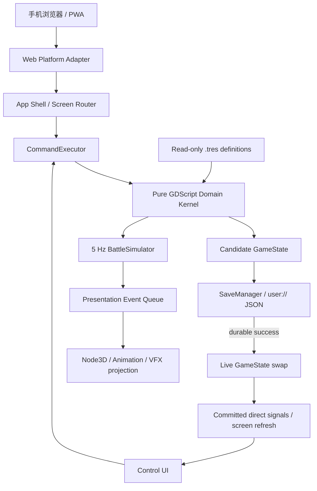

# Web-first 3D 技术架构总览

> 本文已按 schema v8 永久军团架构回填。`FactoryState` 中仍存在的图纸、生产队列和维修字段只用于
> v5/v6/v7 存档读取与迁移兼容，不是运行时业务权威，也不得重新接回玩家入口。

> 当前状态保持 `draft`，因为生产源持久化、移动真机、真人首 30 分钟、最终 IP/商店审查和监控回滚
> 仍未完成。`project-a` 已实现 GL Compatibility、五章 25 关、四入口 App Shell、单线程 Web/PWA、
> 本地产物审计、844×390 Chrome 路径和 schema v8 本地存档。

> 解释规则：新 GDD、产品边界和首 30 分钟合同是目标玩法事实源；旧 PRD/Test Spec 与现有代码只用于识别可复用实现和迁移差距。

## 目标

用 Godot 4.6.3 和 GDScript 制作 3D 马桶人工厂攻城；发布为 Web 游戏，主要在手机浏览器横屏运行。
系统首先保证永久角色、六槽编队、三种后勤资源、设施建造/升级、确定性自动攻城、无损结算、
长期目标与本地持久化正确，再以真实玩家和目标设备证据校准玩法、性能与发布边界。

## 方案选择

| 方案 | 优点 | 代价 | 结论 |
|---|---|---|---|
| A. 耐久领域内核 + 薄 3D 投影 | 可 headless、可重放、可迁移存档；3D 可替换 | DTO、命令和测试样板较多 | **采用** |
| B. Node3D/场景即状态真值 | 视觉原型快 | 存档、离线、重复结算和帧率复现脆弱 | 仅限一次性视觉试验 |
| C. ECS + Navigation/物理驱动战斗 | 扩展大地图、多队方便 | 当前线性攻城切片严重过度建设 | 多队/大地图成为已证需求后重评 |

## 运行时分层



| 层 | 拥有 | 禁止拥有 |
|---|---|---|
| Content | 角色、技能、敌人、关卡、任务、战令、成就与设施的只读 `.tres`/目录定义 | 角色实例、钱包、玩家进度 |
| State | `GameState`、Hero/Economy/Factory/Formation/Onboarding/Meta 等可序列化状态 | Node、scene path、表现对象 |
| Domain | 永久成长、编队、经济、研究突破、任务/战令、离线产出、战斗与无损结算规则 | UI、动画、物理查询、表现帧 Tick |
| Application | 命令分类、幂等 receipt、事务编排、screen use case | 绕过 executor 直接写状态 |
| Persistence | JSON schema、迁移、candidate 写入、备份与恢复 | 业务规则 |
| Presentation 3D | 模型、材质、动画、VFX、相机、插值 | 命中、目标、伤害、掉落、胜负 |
| UI | 状态投影、输入意图、错误反馈 | 直接修改 `GameState` |
| Web Platform | 可持久性检测、visibility、音频解锁、PWA/浏览器桥 | 领域奖励计算 |

## Autoload 边界

当前只注册三个有明确全局生命周期的 Autoload，并保持声明顺序：

1. `SaveManager`：唯一存档 writer，封装 tmp 校验、主备替换、导入导出与恢复。
2. `Game`：持有 live `GameState` 和 `CommandExecutor`，只在耐久写入成功后交换候选状态。
3. `AppBootstrap`：显式取得前两项服务，幂等启动并暴露失败状态。

`WebRuntime`、音频、表现与本地试玩日志由 App Shell 或功能场景拥有，不升级为全局服务。
`MusicDirector.tscn` 是 App Shell 应用生命周期子场景，以两个 Stream 播放器保持跨页面音乐
连续并处理淡化/后台暂停；它不保存领域或页面状态，也不是 Autoload。当前没有为了“解耦”而建立
万能 EventBus；同一功能内优先直接调用/typed signal，跨场景事件也不得执行命令或发奖励。

## 状态、命令和持久化

```text
Persistent GameState
├── schema_version / content_version / save_id / run_seed / revision
├── roster / inventory / formation / economy / factory / camp / quests / achievements / pity
├── stage_progress / attempt_counters / receipt_ledgers
└── saved_at_unix / last_seen_wall_unix / last_settled_unix / offline_anchor_unix

Transient BattleSession
├── tick_index / stage_index / units / structures
├── pending skill requests / artillery warnings
└── bounded presentation queue

Immutable BattleResult
└── battle_id / outcome / ticks / reward / result fields
```

- `DURABLE_VALUE`：角色升级/升星、研究突破、资源领取、设施建造/升级、编队、任务/战令/成就领奖、招募和战斗结算。执行顺序是 candidate clone → reducer → invariants → receipt → JSON durable save → live swap → success。
- `INTERNAL_DURABLE`：离线产出锚和周期刷新等内部耐久更新；仍走同一 candidate-save-commit 边界。
- `REVERSIBLE_META`：当前没有独立降级写入通道；编队也立即耐久提交，筛选和纯页面状态保持 ephemeral。
- `EPHEMERAL`：导航、动画、战斗表现 Tick、详情预览，不进入 `GameState`。

当前存档仍使用兼容文件名 `user://save_v1.json`，内部 schema 已为 8，内容版本为
`toilet-factory-slg-v2`；v5/v6/v7 可迁移，损坏存档由主备恢复路径处理。实现严格 JSON、2 MiB
导入上限、主档/备份恢复、新档持久化、浏览器持久性提示、JSON 下载，以及同一 schema 管线下的
预览和二次确认恢复。设置另存于 `user://settings.cfg`；PWA 缓存不能替代玩家存档。

浏览器后台会暂停处理，因此后台不运行 `_process()` 或战斗 Tick。恢复时只以 `offline_anchor_unix` 计算最多 8 小时的离线收益，并和 anchor、receipt 同事务提交。

## 3D 战斗投影

当前使用六人线性道路推进，不引入自由寻路：

```text
BattleScreen (Node)
├── BattleWorld (Node3D)
│   ├── WorldEnvironment
│   ├── DirectionalLight3D
│   ├── BattleCamera (Camera3D)
│   ├── StageVisual (Node3D)
│   ├── AttackingArmy (0–6 permanent hero views)
│   ├── AllianceBaseModules
│   └── LightweightVFX
└── Hud (CanvasLayer)
    └── SafeAreaRoot (MarginContainer)
```

- 每个可见单位只绑定稳定 `unit_id`，从 `BattleState` snapshot 和 presentation event 更新。
- 逻辑固定 5Hz；渲染帧只做插值。删除并重建模型节点不能改变战斗 digest。
- 可丢普通挥击、飘字；不能丢死亡、关键技能、结构损伤阶段、炮击预警/命中、阶段切换和终局事件。
- 只使用一个主方向光；禁用实时 GI、SSR、体积雾和高成本透明。阴影限主角/关键单位，粒子和飘字池化。
- 物理、RayCast、Area3D 和 NavigationAgent3D 只允许用于输入或视觉辅助，不进入确定性判定。

## Web 运行与发布

- Renderer：Compatibility / WebGL 2.0；单线程 Web/PWA preset 已落地，release 构建生成 HTML/JS/WASM/PCK、manifest、离线页、图标与 service worker。
- Language：纯 GDScript；不使用 C#、原生平台插件或未编译 Web 版本的 GDExtension。
- Threads：默认关闭，减少 Safari/iOS 与托管站点兼容问题。确需开启时，托管必须提供 HTTPS、COOP/COEP 和完整跨源隔离。
- PWA：开启主屏幕图标、display mode 和离线启动缓存；缓存可能被浏览器回收。
- Audio：审计过的 OGG 音效/战果曲与两条 CC0 循环音乐均走 Stream 或有界音效池；标题静音，
  用户首次手势进入后启动基地音乐，后台暂停。生产源首次手势、循环接缝与移动端 Stream
  仍需浏览器/真机验证。
- Canvas：自适应浏览器 viewport、安全区和 DPI；主要触控目标至少 48 基准像素。
- 当前已锁横屏斜俯视和程序化风格化写实低模；商业资产与动画预算仍需发行前冻结。

## 建议性能预算

这些是实施门禁，不是已经验证的事实：

| 项目 | M0/M1 门禁 |
|---|---|
| 首包下载 | 压缩后目标 ≤ 20 MB，硬上限 30 MB |
| 首次可交互 | 中档 4G/Wi-Fi 冷启动目标 ≤ 8 秒 |
| 运行帧率 | 主流手机浏览器 30 FPS 硬门槛，60 FPS 目标 |
| 同屏单位 | 6 名主力 + 少量临时召唤 + 7 个结构目标 |
| 材质/灯光 | 低模、少材质、1 个主方向光、有限阴影 |
| 内存 | 30 分钟运行无持续增长；峰值预算在真机 profiling 后冻结 |
| Battle | 5Hz 逻辑与 30/60/120 渲染帧得到相同 digest |

## 当前目录边界

```text
project-a/
├── project.godot
├── export_presets.cfg
├── game/
│   ├── resources/definitions/stages/
│   ├── scripts/
│   │   ├── autoloads/
│   │   ├── commands/
│   │   ├── state/
│   │   ├── domain/{recruitment,formation,factory,battle,progression,quest,achievement,onboarding,meta}/
│   │   ├── persistence/
│   │   ├── platform/
│   │   ├── presentation_3d/
│   │   └── ui/
│   └── scenes/
├── scenes/screens/
├── scripts/slg_main.gd
├── assets/
├── release/
└── tools/
```

继续拆分时按 feature ownership 增量迁移；不得为了目录整齐创建空树，也不得把领域规则塞回 App Shell。

## 验证与里程碑

| Milestone | 架构交付 | 退出门禁 |
|---|---|---|
| M0 Web shell | Compatibility、Web preset、PWA、audio gate、persistence probe | Chrome Android + Safari iOS 启动；不可持久时明确告警 |
| M1 Durable kernel | GameState、commands、receipt、JSON writer、offline anchor | headless unit、重复 resume、crash/replay、migration |
| M2 Hero/factory/formation | 永久英雄、等级/星级、三材料、设施和六槽编队 | 固定 seed；无悬挂 ID；成长/领取/建造幂等 |
| M3 Battle 1-3 | 5Hz 三阶段 siege、六人、技能、核心炮、3D projector | 跨帧率 digest；禁用 3D 仍同结果；paired +30pp |
| M4 Meta | 目标中心、任务、成就、pity 已落地；装备、设施、离线继续补齐 | 奖励 once、任务/成就不硬锁、首 30 分钟经济 |
| M5 Web production | 1-5 Boss、30 分钟切片、资源优化 | 真机浏览器性能、PWA 更新、5 人观察 |

当前使用 Meta、Battle、Lifecycle、UI smoke、Campaign、Platform、Presentation 七套 headless 脚本验证，并以 release audit 和本地 HTTP 浏览器补足导出证据。Chrome Android、Safari iOS、PWA 安装、后台恢复、IndexedDB 不可用和缓存升级仍待真机/生产源验证。

## 入口或路径

当前可运行入口：[CODE:project-config](../../../project-a/project.godot)、[CODE:main-scene](../../../project-a/scenes/screens/main.tscn)、[CODE:app-shell](../../../project-a/scripts/slg_main.gd)、[CODE:meta-tests](../../../project-a/tools/run_meta_tests.gd)、[CODE:battle-tests](../../../project-a/tools/run_battle_tests.gd)。

计划状态/命令契约：[KM:reference.state-command-lifecycle](state-command-lifecycle.md)。

## 验证

- 当前已验证：Godot 4.6.3、Compatibility、schema v8、25 关骨架、首章 7-seed 扫描、14 条新档旅程、
  长期目标、暂停/失焦、表现降级、字体覆盖、焦点可见和完整 headless suite。
- 已验证：单线程 Web/PWA 可复现导出、artifact audit，以及本机 Chrome 的触控、导入导出、刷新、
  离线启动和 IndexedDB 身份。
- 尚未验证：生产源持久性、Firefox、Chrome Android、Safari iOS、目标手机性能、真人盲测和最终商业审查。

## 相关节点

[KM:decision.project-a-web-3d-root](../../decisions/ADR-0005-project-a-web-3d-root.md)。

[KM:reference.file-ownership](../indexes/file-ownership.md)。
[KM:decision.project-a-game-root](../../decisions/ADR-0003-project-a-game-root.md)。

[KM:decision.taptap-maker-game-root](../../decisions/ADR-0004-taptap-maker-game-root.md)。

[KM:decision.return-to-project-a](../../decisions/ADR-0005-return-to-project-a.md)。
