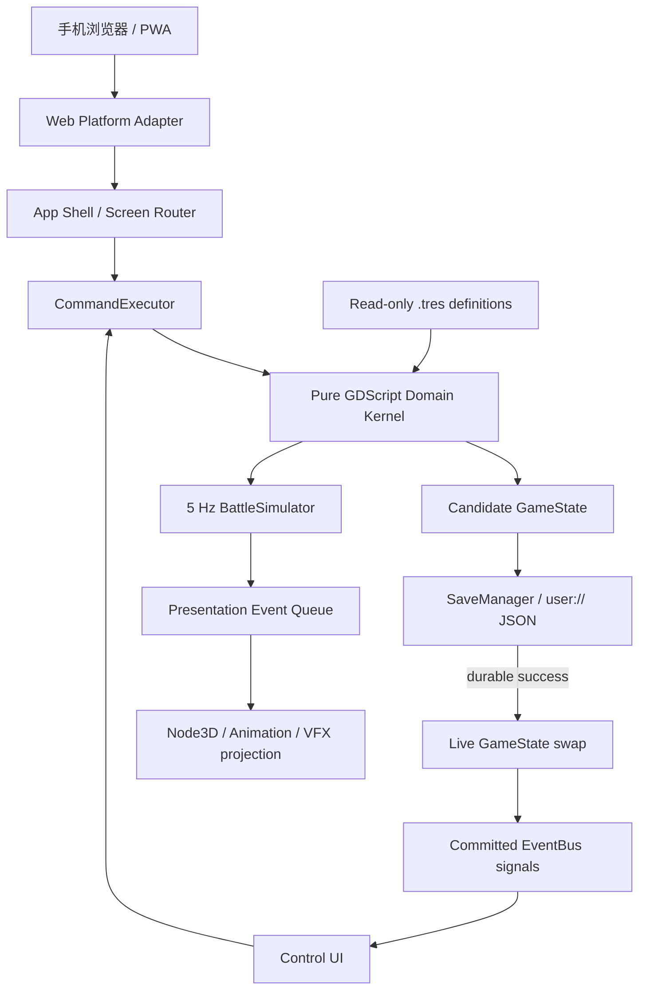

# Web-first 3D 技术架构总览

<<<<<<< HEAD
> 当前状态保持 `draft`，因为 PWA、浏览器平台适配、装备、任务和离线仍未完成。`project-a` 已切换 GL Compatibility，单线程 Web release 导出与本地 HTTP 浏览器交互已通过，并已实现 v2 Meta 领域内核、工厂/培育/六人编队与三阶段 3D 攻城可玩切片。

> 解释规则：PRD/Test Spec 中的核心循环、内容、经济和验收指标仍是事实源；其 Godot 4.7.1、2D、Mobile renderer、Android-first 平台描述已由 ADR-0005 取代。

## 目标

用 Godot 4.6.3 和 GDScript 制作 3D 马桶人工厂攻城；发布为 Web 游戏，主要在手机浏览器横屏运行。系统首先保证工厂生产、永久培育、六人编队、确定性自动攻城和单机存档正确，再逐步补齐 Web 平台、离线收益、装备任务和 3D 表现预算。
=======
> 当前实现核心已回到 `project-a/` Godot 工程。Godot M0 shell 已验证，但批准规划中的随机英雄、四槽编队、随机装备和可重放领域门禁仍未落地，因此本节点保持 `draft`。TapTap Maker 原型只作为参考实现保留。

## 目标

用小型 GDScript 领域内核承载状态、战斗、任务、离线和持久化语义，用 Godot Node、Resource、Autoload 与 Control 负责生命周期、内容和纯 2D 表现。
>>>>>>> origin/codex/toilet-man-3d-idle

## 方案选择

<<<<<<< HEAD
| 方案 | 优点 | 代价 | 结论 |
|---|---|---|---|
| A. 耐久领域内核 + 薄 3D 投影 | 可 headless、可重放、可迁移存档；3D 可替换 | DTO、命令和测试样板较多 | **采用** |
| B. Node3D/场景即状态真值 | 视觉原型快 | 存档、离线、重复结算和帧率复现脆弱 | 仅限一次性视觉试验 |
| C. ECS + Navigation/物理驱动战斗 | 扩展大地图、多队方便 | 当前线性攻城切片严重过度建设 | 多队/大地图成为已证需求后重评 |

## 运行时分层



| 层 | 拥有 | 禁止拥有 |
|---|---|---|
| Content | 职业、技能、特质、敌人、装备、关卡、任务、设施的只读 `Resource` | 英雄/装备实例、玩家进度 |
| State | `GameState`、Hero/Item/Formation/Quest/Camp 等可序列化实例 | Node、Resource、scene path |
| Domain | 招募、培养、编队、装备、经济、任务、离线、战斗规则 | UI、动画、物理查询、wall-time Tick |
| Application | 命令分类、幂等 receipt、事务编排、screen use case | 绕过 executor 直接写状态 |
| Persistence | JSON schema、迁移、candidate 写入、备份与恢复 | 业务规则 |
| Presentation 3D | 模型、材质、动画、VFX、相机、插值 | 命中、目标、伤害、掉落、胜负 |
| UI | 状态投影、输入意图、错误反馈 | 直接修改 `GameState` |
| Web Platform | 可持久性检测、visibility、音频解锁、PWA/浏览器桥 | 领域奖励计算 |

## Autoload 边界

目标架构按以下顺序注册：

1. `SystemClock`：提供可替换 wall clock；测试可注入（未实现）。
2. `SaveManager`：唯一存档 writer（首版已实现）。
3. `ContentCatalog`：加载并校验只读 `.tres` 定义（未实现）。
4. `EventBus`：仅广播已经提交的状态变化和界面级事件（未实现）。
5. `Game`：持有 live `GameState`，暴露 command API（首版已实现）。
6. `WebLifecycle`：处理浏览器前后台、持久性告警和恢复结算，只能调用 sealed internal command（未实现）。

`EventBus` 不能执行命令、发奖励或串联领域副作用。功能内部优先直接调用/直接 signal；跨 screen 的 UI、音频和 3D 投影才消费全局事件。

## 状态、命令和持久化

```text
Persistent GameState
├── schema_version / content_version / save_id / run_seed / revision
├── roster / inventory / formation / economy / factory / camp / quests / pity
├── stage_progress / attempt_counters / receipt_ledgers
└── saved_at_unix / last_seen_wall_unix / last_settled_unix / offline_anchor_unix

Transient BattleSession
├── tick_index / stage_index / units / structures
├── pending skill requests / artillery warnings
└── bounded presentation queue

Immutable BattleResult
└── battle_id / outcome / ticks / reward / result fields
```

- `DURABLE_VALUE`：招募、训练、开始生产、领取生产、3 合 1 合成、强化、设施升级、领奖、战斗与离线结算。执行顺序是 candidate clone → reducer → invariants → receipt → JSON durable save → live swap → success。
- `INTERNAL_DURABLE`：前后台 anchor 与 resume settlement，仅 `WebLifecycle` 通过 internal capability 发起。
- `REVERSIBLE_META`：编队、装备、筛选和重命名，可 1000ms debounce。
- `EPHEMERAL`：导航、动画、战斗表现 Tick、详情预览，不进入 `GameState`。

当前存档仍使用 `user://save_v1.json` 文件名，但内部 schema 已为 2，content version 为 `factory-siege-v2`；实现严格 JSON schema、v1->v2 迁移、主档/备份恢复、新档持久化以及损坏存档 bootstrap gate。浏览器端的持久性探测、不可持久告警和导出/导入降级尚未实现；PWA 缓存不能替代玩家存档。

浏览器后台会暂停处理，因此后台不运行 `_process()` 或战斗 Tick。恢复时只以 `offline_anchor_unix` 计算最多 8 小时的离线收益，并和 anchor、receipt 同事务提交。

## 3D 战斗投影

当前使用六人线性道路推进，不引入自由寻路：

```text
BattleScreen (Node)
├── BattleWorld (Node3D)
│   ├── WorldEnvironment
│   ├── DirectionalLight3D
│   ├── BattleCamera (Camera3D)
│   ├── StageVisual (Node3D)
│   ├── AllyViews (6 main + temporary summons)
│   ├── StructureViews (7 siege structures)
│   ├── Units (Node3D)
│   └── VfxPool (Node3D)
└── Hud (CanvasLayer)
    └── SafeAreaRoot (MarginContainer)
```

- 每个可见单位只绑定稳定 `unit_id`，从 `BattleState` snapshot 和 presentation event 更新。
- 逻辑固定 5Hz；渲染帧只做插值。删除并重建模型节点不能改变战斗 digest。
- 可丢普通挥击、飘字；不能丢死亡、关键技能、结构损伤阶段、炮击预警/命中、阶段切换和终局事件。
- 只使用一个主方向光；禁用实时 GI、SSR、体积雾和高成本透明。阴影限主角/关键单位，粒子和飘字池化。
- 物理、RayCast、Area3D 和 NavigationAgent3D 只允许用于输入或视觉辅助，不进入确定性判定。

## Web 运行与发布

- Renderer：Compatibility / WebGL 2.0；当前配置和单线程 Web export preset 已落地，release 构建可生成 `index.html/.pck/.wasm`。
- Language：纯 GDScript；不使用 C#、原生平台插件或未编译 Web 版本的 GDExtension。
- Threads：默认关闭，减少 Safari/iOS 与托管站点兼容问题。确需开启时，托管必须提供 HTTPS、COOP/COEP 和完整跨源隔离。
- PWA：开启主屏幕图标、display mode 和离线启动缓存；缓存可能被浏览器回收。
- Audio：首个“点击开始”手势解锁音频；默认避免依赖 AudioEffect、程序化音频和关键的 3D positional audio。
- Canvas：自适应浏览器 viewport、安全区和 DPI；主要触控目标至少 48 基准像素。
- 当前未决：竖屏/横屏、固定正交斜视/透视侧视、最终低模与动画预算。

## 建议性能预算

这些是实施门禁，不是已经验证的事实：

| 项目 | M0/M1 门禁 |
|---|---|
| 首包下载 | 压缩后目标 ≤ 20 MB，硬上限 30 MB |
| 首次可交互 | 中档 4G/Wi-Fi 冷启动目标 ≤ 8 秒 |
| 运行帧率 | 主流手机浏览器 30 FPS 硬门槛，60 FPS 目标 |
| 同屏单位 | 6 名主力 + 少量临时召唤 + 7 个结构目标 |
| 材质/灯光 | 低模、少材质、1 个主方向光、有限阴影 |
| 内存 | 30 分钟运行无持续增长；峰值预算在真机 profiling 后冻结 |
| Battle | 5Hz 逻辑与 30/60/120 渲染帧得到相同 digest |

## 目标目录

```text
project-a/
├── project.godot
├── export_presets.cfg
├── game/
│   ├── resources/definitions/{classes,skills,traits,enemies,equipment,affixes,stages,quests,facilities}/
│   ├── scripts/
│   │   ├── autoloads/
│   │   ├── commands/
│   │   ├── state/
│   │   ├── domain/{recruitment,formation,factory,battle,loot,progression,quests,idle}/
│   │   ├── persistence/
│   │   ├── platform/web/
│   │   ├── presentation_3d/
│   │   └── ui/
│   └── scenes/{app,battle_3d,characters,screens,dialogs,ui}/
├── tests/{unit,integration,fixtures,web}/
└── tools/
```

这些路径是 planned ownership；存在前不得用 `CODE:*` 标为实现事实。

## 验证与里程碑

| Milestone | 架构交付 | 退出门禁 |
|---|---|---|
| M0 Web shell | Compatibility、Web preset、PWA、audio gate、persistence probe | Chrome Android + Safari iOS 启动；不可持久时明确告警 |
| M1 Durable kernel | GameState、commands、receipt、JSON writer、offline anchor | headless unit、重复 resume、crash/replay、migration |
| M2 Hero/factory/formation | 8 英雄、L1-L5、三材料八配方、3 队列、3 合 1、六槽编队 | 固定 seed；8 英雄；无悬挂 ID；生产/领取/合成幂等 |
| M3 Battle 1-3 | 5Hz 三阶段 siege、六人、技能、核心炮、3D projector | 跨帧率 digest；禁用 3D 仍同结果；paired +30pp |
| M4 Meta | 装备、pity、任务、设施、离线 | 奖励 once、任务不硬锁、首 30 分钟经济 |
| M5 Web production | 1-5 Boss、30 分钟切片、资源优化 | 真机浏览器性能、PWA 更新、5 人观察 |

当前 v2 使用 `tools/run_meta_tests.gd` 和 `tools/run_battle_tests.gd` 做无场景 headless 验证。目标测试体系仍计划使用 GUT：领域单元测试不加载场景；场景集成测试只验证投影契约；Web smoke 覆盖 Chrome Android、Safari iOS、PWA 安装、后台恢复、IndexedDB 不可用、缓存升级。CI 尚未落地，目标顺序为 headless tests、Compatibility import、Web release export 和静态托管 smoke。

## 入口或路径

当前可运行入口：[CODE:project-config](../../../project-a/project.godot)、[CODE:main-scene](../../../project-a/scenes/screens/main.tscn)、[CODE:app-shell](../../../project-a/scripts/main.gd)、[CODE:meta-tests](../../../project-a/tools/run_meta_tests.gd)、[CODE:battle-tests](../../../project-a/tools/run_battle_tests.gd)。

计划状态/命令契约：[KM:reference.state-command-lifecycle](state-command-lifecycle.md)。

## 验证

- 当前已验证：Godot 4.6.3、Compatibility 配置、headless 编辑器导入、主场景启动，以及 v2 Meta 的 GameState、8 英雄、L1-L5、工厂生产、3 合 1、六槽、经济、命令事务、严格 JSON、v1->v2 迁移、主备恢复、bootstrap gate 和三阶段战斗领域测试。
- 已验证：Web release export，以及 844×390 本地 HTTP 浏览器中的完整中文启动和核心循环交互。
- 尚未验证：PWA、浏览器持久性探测、音频解锁、WebLifecycle、离线结算、装备、任务、Chrome Android/Safari iOS 真机性能、跨帧率 digest 和 paired balance。
=======
- 继续采用领域内核 + 薄 Godot 外壳，按 vertical slice milestone 交付；Godot/GDScript 是当前默认语言和运行时。
- Control 与表现节点不得成为持久状态真值。
- 不引入 DI 框架、ECS、数据库或自定义编辑器框架。
- `project-a/game/scripts/autoloads/**` 只承担跨场景服务与编排；领域状态、命令和表现层继续分离。
- M0 已有 `SaveManager`、`ContentCatalog`、`EventBus`、`Game` 和 `AppLifecycle` Autoload；后续 command/receipt 与领域模型仍需补齐。
- 持久 `GameState` 与临时 `BattleSession/BattleState` 分离；只有 `BattleResult` 进入结算。
- 领域逻辑必须可在无 UI 的 GUT/headless 测试与模拟中运行；UI 通过信号和查询投影状态。
- TapTap 原型中的自动战斗、离线收益、培养和手机 UI 只能作为需求与行为参考，不能成为 Godot 的状态真值或完成证据。

## 入口或路径

当前工程入口为 [CODE:godot-project](../../../project-a/project.godot) 和 `project-a/game/scenes/app/main.tscn`，M0 验证入口为 [CODE:m0-verifier](../../../project-a/tools/verify_m0.sh)。TapTap 参考入口仍为 [CODE:taptap-main](../../../taptap/scripts/main.lua)；其余规划目录见 [KM:reference.file-ownership](../indexes/file-ownership.md)。

## 验证

Godot M0 已通过 headless 与 GUT 基线；M1 durable state/commands，M2 随机英雄/四槽编队，M3 可重放战斗，M4 装备/任务/营地，M5 Android 设备证据待实现。TapTap 原型的远端构建记录继续作为参考原型证据保留。
>>>>>>> origin/codex/toilet-man-3d-idle

## 相关节点

[KM:decision.project-a-web-3d-root](../../decisions/ADR-0005-project-a-web-3d-root.md)。

<<<<<<< HEAD
[KM:reference.file-ownership](../indexes/file-ownership.md)。
=======
[KM:decision.project-a-game-root](../../decisions/ADR-0003-project-a-game-root.md)。

[KM:decision.taptap-maker-game-root](../../decisions/ADR-0004-taptap-maker-game-root.md)。

[KM:decision.return-to-project-a](../../decisions/ADR-0005-return-to-project-a.md)。
>>>>>>> origin/codex/toilet-man-3d-idle
